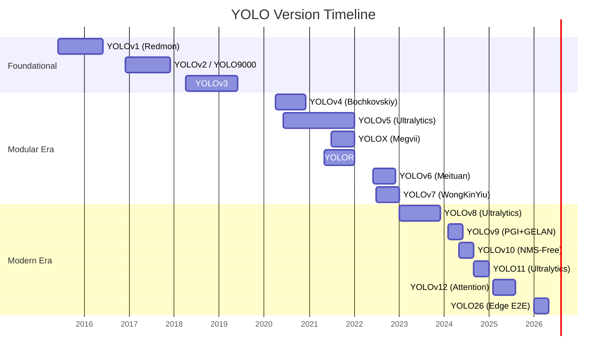
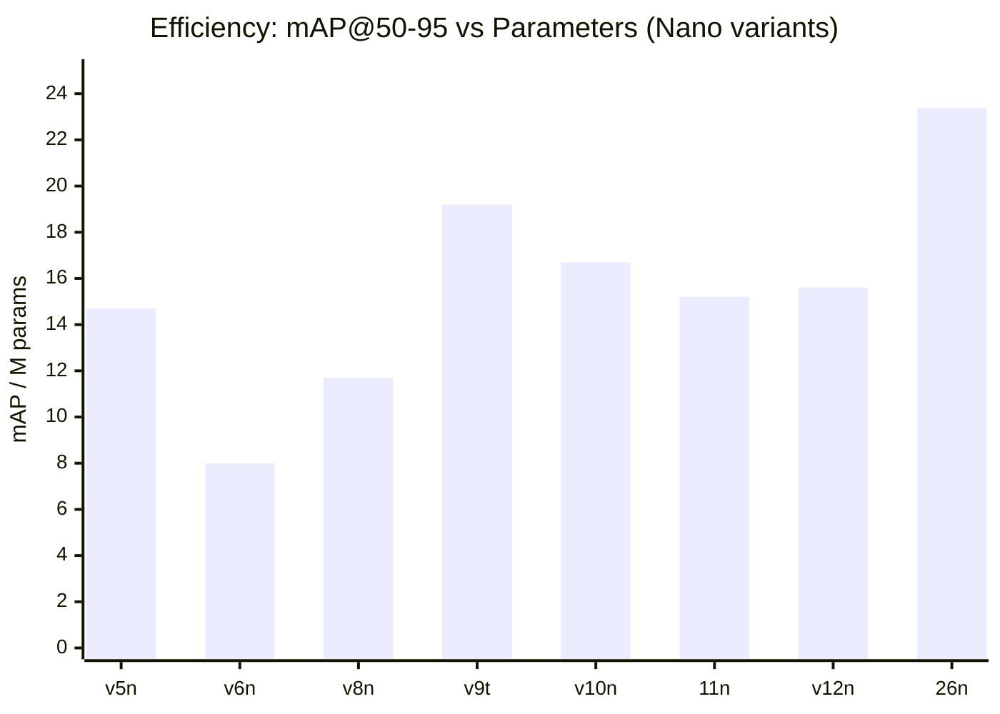
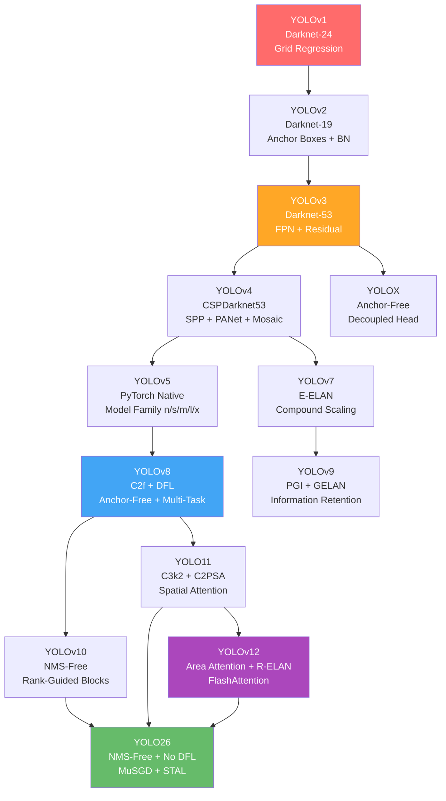
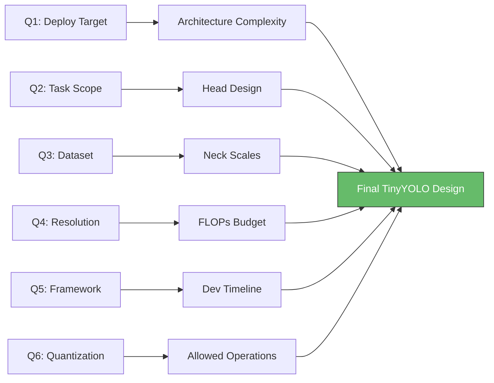

# YOLO Complete Analysis: v1 → v26

## 1. The YOLO Timeline



---

## 2. Version-by-Version Deep Dive

### Phase 1: Foundational (2015–2018)

#### YOLOv1 (2015) — *"You Only Look Once"*
| Attribute | Value |
|-----------|-------|
| **Author** | Joseph Redmon et al. |
| **Backbone** | Custom 24-layer CNN (Darknet) |
| **Detection** | Grid-based regression (7×7 grid, 2 boxes/cell) |
| **mAP (VOC)** | ~63.4% |
| **Params** | ~45M |
| **Speed** | 45 FPS (Titan X) |

**Key Innovations:**
- First single-shot detector — unified detection as regression
- Processes entire image in one forward pass (vs. R-CNN's region proposals)
- Global context reasoning

**Limitations:**
- Poor small object detection (coarse 7×7 grid)
- Max 2 objects per grid cell
- High localization error

---

#### YOLOv2 / YOLO9000 (2016) — *"Better, Faster, Stronger"*
| Attribute | Value |
|-----------|-------|
| **Backbone** | Darknet-19 (19 conv + 5 maxpool) |
| **Detection** | Anchor boxes (5 priors via k-means) |
| **mAP (VOC)** | ~78.6% |
| **mAP (COCO)** | ~21.6% |
| **Params** | ~50M |
| **Speed** | 67 FPS |

**Key Innovations:**
- Batch Normalization on all conv layers (+2% mAP)
- Anchor boxes via k-means clustering
- Multi-scale training (random resize 320–608)
- Passthrough layer for fine-grained features
- WordTree for hierarchical 9000-class detection

---

#### YOLOv3 (2018) — *"An Incremental Improvement"*
| Attribute | Value |
|-----------|-------|
| **Backbone** | Darknet-53 (53 conv layers + residual connections) |
| **Neck** | FPN (Feature Pyramid Network) |
| **Detection** | 3-scale prediction (13×13, 26×26, 52×52) |
| **mAP (COCO)** | ~33.0% (mAP@0.5: 57.9%) |
| **Params** | ~62M |
| **GFLOPs** | ~140 |

**Key Innovations:**
- Residual connections in backbone (from ResNet)
- Multi-scale detection via FPN — major improvement for small objects
- Independent logistic classifiers (multi-label per box)
- 9 anchor boxes (3 per scale)

---

### Phase 2: Modular & Community Era (2020–2022)

#### YOLOv4 (2020) — *"Optimal Speed and Accuracy"*
| Attribute | Value |
|-----------|-------|
| **Author** | Alexey Bochkovskiy et al. |
| **Backbone** | CSPDarknet53 |
| **Neck** | SPP + PANet |
| **mAP (COCO)** | ~43.5% |
| **Params** | ~64M |
| **GFLOPs** | ~120 |

**Key Innovations:**
- **Bag of Freebies** (training tricks): Mosaic augmentation, CutMix, DropBlock, label smoothing
- **Bag of Specials** (architecture): SPP, SAM, PAN, Mish activation
- CSP (Cross Stage Partial) connections for gradient flow
- Self-adversarial training

---

#### YOLOv5 (2020) — *"Production-Ready YOLO"*
| Variant | mAP@50-95 | Params (M) | GFLOPs |
|---------|-----------|------------|--------|
| v5n | 28.0% | 1.9 | 4.5 |
| v5s | 37.4% | 7.2 | 16.5 |
| v5m | 45.4% | 21.2 | 48.3 |
| v5l | 49.0% | 46.5 | 109.1 |
| v5x | 50.7% | 86.7 | 205.7 |

**Key Innovations:**
- First PyTorch-native YOLO (Ultralytics)
- Auto-anchor learning
- Standardized model family (n/s/m/l/x)
- Hyperparameter evolution
- Built-in export (ONNX, TensorRT, CoreML, TFLite)
- Massive community adoption

---

#### YOLOX (2021) — *Megvii*
**Key Innovations:**
- Anchor-free detection head
- Decoupled head (separate cls/reg branches)
- SimOTA dynamic label assignment
- Strong data augmentation (MixUp + Mosaic)

#### YOLOR (2021) — *Unified Representation*
**Key Innovation:** Implicit + explicit knowledge integration in a single network.

#### YOLOv6 (2022) — *Meituan*
| Variant | mAP@50-95 | Params (M) | GFLOPs |
|---------|-----------|------------|--------|
| v6n | 37.5% | 4.7 | 11.4 |
| v6s | 45.0% | 12.5 | 28.6 |

**Key Innovations:**
- EfficientRep backbone
- Rep-PAN neck
- Task Alignment Learning (TAL)
- Self-distillation strategy
- Industry/hardware-aware design

---

#### YOLOv7 (2022) — *WongKinYiu*
| Attribute | Value |
|-----------|-------|
| **mAP (COCO)** | ~51.4% (at 640px) |
| **Key Module** | E-ELAN (Extended ELAN) |

**Key Innovations:**
- E-ELAN: expand/shuffle/merge for gradient diversity
- Compound model scaling (depth + width + resolution)
- Planned re-parameterized convolution
- Coarse-to-fine lead head guided label assigner

---

### Phase 3: Modern Architectural Innovations (2023–2026)

#### YOLOv8 (2023) — *Ultralytics Unified Framework*
| Variant | mAP@50-95 | Params (M) | GFLOPs |
|---------|-----------|------------|--------|
| v8n | 37.3% | 3.2 | 8.7 |
| v8s | 44.9% | 11.2 | 28.7 |
| v8m | 50.2% | 25.9 | 78.9 |
| v8l | 52.9% | 43.7 | 165.2 |
| v8x | 53.9% | 68.2 | 257.8 |

**Key Innovations:**
- Anchor-free detection head
- C2f module (Cross-Stage Partial with 2 convolutions + flow)
- Unified multi-task: Detection, Segmentation, Pose, Classification, OBB
- Distribution Focal Loss (DFL) for box regression
- TaskAlignedAssigner

---

#### YOLOv9 (Feb 2024) — *"Information Retention"*
| Variant | mAP@50-95 | Params (M) | GFLOPs |
|---------|-----------|------------|--------|
| v9t | ~38.3% | 2.0 | 7.7 |
| v9s | ~46.8% | 7.3 | 26.8 |

**Key Innovations:**
- **PGI** (Programmable Gradient Information): Combats information loss during downsampling
- **GELAN** (Generalized ELAN): Combines CSPNet + ELAN strengths
- Auxiliary reversible branch for training
- Superior parameter utilization

---

#### YOLOv10 (May 2024) — *"End-to-End NMS-Free"*
| Variant | mAP@50-95 | Params (M) | GFLOPs |
|---------|-----------|------------|--------|
| v10n | 38.5% | 2.3 | 5.9 |
| v10s | 44.3% | 7.2 | 17.2 |

**Key Innovations:**
- **NMS-Free** inference via consistent dual assignments
- Rank-guided block design (removes redundancy)
- Spatial-channel decoupled downsampling
- Lightweight classification head
- Large-kernel convolution in deeper stages

---

#### YOLO11 (Sept 2024) — *"Refined Production"*
| Variant | mAP@50-95 | Params (M) | GFLOPs |
|---------|-----------|------------|--------|
| 11n | 39.5% | 2.6 | 6.6 |
| 11s | 47.0% | 9.4 | 21.7 |
| 11m | 51.5% | 20.1 | 68.0 |
| 11l | 53.4% | 25.3 | 86.9 |

**Key Innovations:**
- **C3k2 Block**: Optimized CSP with smaller kernels → fewer FLOPs
- **C2PSA** (Cross-Stage Partial Spatial Attention)
- Better small/occluded object detection
- Refined backbone/neck architecture
- Full multi-task support (Det/Seg/Pose/OBB/Cls)

---

#### YOLOv12 (Feb 2025) — *"Attention-Centric YOLO"*
| Variant | mAP@50-95 | Params (M) | GFLOPs |
|---------|-----------|------------|--------|
| v12n | 40.6% | 2.6 | 6.5 |
| v12s | 48.0% | 9.3 | 21.5 |

**Key Innovations:**
- **Area Attention**: Local-to-global attention with reduced cost vs. full self-attention
- **R-ELAN** (Residual ELAN): Residual connections + scaling factors for stability
- **FlashAttention** integration for memory efficiency
- 7×7 separable conv replaces positional encoding
- Adjusted MLP ratio for attention/FFN balance
- CNN-speed with Transformer-quality representations

> [!IMPORTANT]
> YOLOv12 is the first YOLO to fundamentally shift from pure CNN to attention-centric design while maintaining real-time speed.

---

#### YOLO26 (Jan 2026) — *"Deployment-First Edge YOLO"*
| Variant | mAP@50-95 | Params (M) | GFLOPs |
|---------|-----------|------------|--------|
| 26n | 39.8% (40.3 e2e) | 1.7 | 2.4 |
| 26s | 47.2% (47.6 e2e) | 2.7 | 9.5 |
| 26m | 51.5% (51.7 e2e) | 4.9 | 20.4 |
| 26l | 53.0% | 6.5 | 24.8 |

**Key Innovations:**
- **Native NMS-Free** end-to-end inference
- **Removed DFL** → lighter parameterization, easier export
- **MuSGD Optimizer**: SGD + Muon hybrid for faster convergence
- **ProgLoss**: Progressive loss balancing during training
- **STAL**: Small-Target-Aware Label Assignment
- Up to **43% faster CPU inference** vs YOLO11n
- Full multi-task: Det/Seg/Pose/OBB/Cls

---

## 3. Grand Comparison Table (Nano/Small Variants)

| Model | Year | Params (M) | GFLOPs | mAP@50-95 | NMS-Free | Attention | Multi-Task |
|-------|------|-----------|--------|-----------|----------|-----------|------------|
| YOLOv5n | 2020 | 1.9 | 4.5 | 28.0% | ❌ | ❌ | ❌ |
| YOLOv5s | 2020 | 7.2 | 16.5 | 37.4% | ❌ | ❌ | ❌ |
| YOLOv6n | 2022 | 4.7 | 11.4 | 37.5% | ❌ | ❌ | ❌ |
| YOLOv8n | 2023 | 3.2 | 8.7 | 37.3% | ❌ | ❌ | ✅ |
| YOLOv8s | 2023 | 11.2 | 28.7 | 44.9% | ❌ | ❌ | ✅ |
| YOLOv9t | 2024 | 2.0 | 7.7 | 38.3% | ❌ | ❌ | ✅ |
| YOLOv10n | 2024 | 2.3 | 5.9 | 38.5% | ✅ | ❌ | ❌ |
| YOLO11n | 2024 | 2.6 | 6.6 | 39.5% | ❌ | Partial | ✅ |
| YOLO11s | 2024 | 9.4 | 21.7 | 47.0% | ❌ | Partial | ✅ |
| YOLOv12n | 2025 | 2.6 | 6.5 | 40.6% | ❌ | ✅ | ✅ |
| YOLOv12s | 2025 | 9.3 | 21.5 | 48.0% | ❌ | ✅ | ✅ |
| **YOLO26n** | **2026** | **1.7** | **2.4** | **39.8%** | **✅** | ❌ | **✅** |
| **YOLO26s** | **2026** | **2.7** | **9.5** | **47.2%** | **✅** | ❌ | **✅** |

---

## 4. Efficiency Evolution (mAP per Parameter)



> [!TIP]
> YOLO26n achieves the highest mAP-per-parameter ratio at **23.4 mAP/M**, followed by YOLOv9t at **19.2**. This indicates YOLO26 has the most efficient parameter utilization.

---

## 5. Key Innovations Timeline

| Innovation | First Introduced | Impact |
|-----------|-----------------|--------|
| Single-shot detection | v1 (2015) | Paradigm shift from R-CNN |
| Anchor boxes | v2 (2016) | Better localization |
| Batch Normalization | v2 (2016) | Training stability |
| Multi-scale FPN | v3 (2018) | Small object detection |
| Residual connections | v3 (2018) | Deeper networks |
| CSP connections | v4 (2020) | Gradient flow optimization |
| Mosaic augmentation | v4 (2020) | Better generalization |
| Model family (n/s/m/l/x) | v5 (2020) | Scalability |
| Anchor-free detection | YOLOX (2021) | Simpler pipeline |
| Decoupled head | YOLOX (2021) | Better cls/reg separation |
| E-ELAN | v7 (2022) | Gradient diversity |
| Distribution Focal Loss | v8 (2023) | Better box regression |
| Unified multi-task | v8 (2023) | One model, many tasks |
| PGI + GELAN | v9 (2024) | Information retention |
| NMS-Free inference | v10 (2024) | Latency reduction |
| C2PSA attention | YOLO11 (2024) | Spatial awareness |
| Area Attention | v12 (2025) | CNN+Transformer fusion |
| R-ELAN | v12 (2025) | Stable attention training |
| MuSGD optimizer | YOLO26 (2026) | Faster convergence |
| STAL label assignment | YOLO26 (2026) | Small target accuracy |
| DFL removal | YOLO26 (2026) | Edge deployment simplicity |

---

## 6. Best & Worst Use Cases by Version

### Best Model for Each Scenario

| Scenario | Best Choice | Why |
|----------|-------------|-----|
| **Edge/Mobile (CPU)** | YOLO26n | Lowest FLOPs (2.4B), NMS-free, 43% faster CPU |
| **Real-time GPU** | YOLO11s/YOLOv12s | Best mAP at moderate compute |
| **Maximum accuracy** | YOLOv12x / YOLO11x | Attention mechanisms boost ceiling |
| **Small objects** | YOLO26 (STAL) / YOLOv12 | Specialized small-target mechanisms |
| **Crowded scenes** | YOLOv12 (Area Attention) | Global context via attention |
| **Multi-task (Seg+Pose+OBB)** | YOLO11 / YOLO26 | Native unified support |
| **Easy deployment/export** | YOLO26 | No NMS, no DFL, clean graph |
| **Research/experimentation** | YOLOv9 (PGI) | Novel gradient information concepts |
| **Legacy/compatibility** | YOLOv5/v8 | Massive ecosystem & community |
| **Autonomous vehicles** | YOLO11l / YOLO26m | Balance of speed + accuracy |

### Known Weaknesses

| Version | Primary Weakness |
|---------|-----------------|
| v1–v3 | Small objects, crowded scenes, high params |
| v4 | Complex training setup, Darknet framework |
| v5 | No anchor-free option, aging backbone |
| v6 | Limited multi-task, PaddlePaddle-centric (v6 variants) |
| v7 | Complex scaling, limited ecosystem |
| v8 | DFL adds export complexity, NMS required |
| v9 | Auxiliary branch adds training overhead |
| v10 | Limited multi-task support initially |
| YOLO11 | Still requires NMS in standard mode |
| v12 | Higher memory (attention), complex architecture |
| YOLO26 | Newest — less battle-tested in production |

---

## 7. Architectural Evolution Diagram



---

## 8. Design Direction for TinyYOLO

Based on the analysis above, here's the strategic direction for our custom **tinyYOLO**:

### Design Philosophy
> Build a model that sits in the **"sweet spot"** — smaller than YOLO26n in parameters, but smarter in feature utilization, targeting **≤1.5M params**, **≤2.0 GFLOPs**, while maintaining **≥35% mAP@50-95** on COCO.

### Techniques to Cherry-Pick from Each Version

| From | Technique | Why |
|------|-----------|-----|
| YOLOv4 | Mosaic augmentation | Free accuracy boost (training only) |
| YOLOX | Decoupled head | Better cls/reg separation |
| YOLOv8 | Anchor-free detection | Simpler, fewer hyperparameters |
| YOLOv9 | GELAN-inspired blocks | Efficient feature aggregation |
| YOLOv10 | NMS-free inference | Lower latency, cleaner deployment |
| YOLO11 | Lightweight spatial attention | Focus on important regions |
| YOLO26 | No DFL, STAL | Simpler export + small object handling |

### Architecture Blueprint (Preliminary)

```
Input (320×320 or 416×416)
    │
    ├── Backbone: GhostNet-inspired + Depthwise Separable Conv
    │   ├── Stage 1: 3×3 DWConv, stride 2 → 16ch
    │   ├── Stage 2: Ghost Bottleneck → 32ch
    │   ├── Stage 3: Ghost Bottleneck → 64ch  ← P3 (small objects)
    │   ├── Stage 4: Ghost Bottleneck → 128ch ← P4 (medium)
    │   └── Stage 5: Ghost Bottleneck → 256ch ← P5 (large)
    │
    ├── Neck: Lite-PAN (depthwise separable FPN+PAN)
    │   ├── Lightweight channel attention (SE or ECA)
    │   └── Feature fusion at P3, P4, P5
    │
    └── Head: Decoupled, Anchor-Free, NMS-Free
        ├── Classification branch (lightweight)
        ├── Regression branch (no DFL)
        └── Consistent dual assignment (training)
```

### Target Specifications

| Metric | Target | Comparison (YOLO26n) |
|--------|--------|---------------------|
| Parameters | ≤1.5M | 1.7M |
| GFLOPs | ≤2.0 | 2.4 |
| mAP@50-95 | ≥35% | 39.8% |
| Input Size | 320×320 | 640×640 |
| NMS-Free | ✅ | ✅ |
| Export | ONNX/TFLite/CoreML | ✅ |
| Edge FPS (CPU) | ≥60 | ~45 |

### Training Strategy
1. **Knowledge Distillation** from YOLO26s (teacher) → tinyYOLO (student)
2. **Progressive resizing**: Train 160→224→320
3. **Mosaic + MixUp** augmentation
4. **MuSGD** or Lion optimizer
5. **STAL** label assignment for small objects
6. **Cosine annealing** with warmup

> [!NOTE]
> The goal is NOT to beat YOLO26n on accuracy — it's to achieve **≥88% of its accuracy at ≤60% of its compute**, making it viable for microcontrollers, drones, and IoT devices.

---

## 9. Open Questions — Design Decisions That Shape Everything

Each question below directly impacts the architecture, training strategy, and deployment pipeline of our tinyYOLO. I've broken down **why each matters**, the **trade-offs involved**, and **what changes** based on your answer.

---

### Q1. Primary Deployment Target

**Question:** Where will this model ultimately run?

| Target | Compute Budget | Memory | Typical FPS Goal | Architecture Impact |
|--------|---------------|--------|------------------|-------------------|
| **MCU** (STM32, ESP32, Arduino) | ≤100 MOPS | ≤512KB RAM | 1–5 FPS | Must use INT8, no attention, ≤0.5M params, no dynamic ops |
| **Raspberry Pi 4/5** | ~13 GFLOPS (CPU) | 2–8GB | 10–30 FPS | Can use FP32/INT8, moderate backbone, depthwise conv OK |
| **Jetson Nano/Orin** | 472 GFLOPS (GPU) | 4–8GB | 30–120 FPS | GPU-optimized, can use attention, TensorRT export critical |
| **Mobile** (Android/iOS) | ~5 TOPS (NPU) | 3–8GB | 30–60 FPS | Must export TFLite/CoreML, channel counts must be NPU-friendly (multiples of 8/16) |
| **Browser** (WebAssembly/WebGL) | Variable | Limited | 15–30 FPS | ONNX.js or TF.js, no custom ops, must be ≤5MB model file |
| **Drone/Robotics** | Mixed | Limited | 15–60 FPS | Low power draw matters, latency consistency critical |

> [!IMPORTANT]
> **Why this matters:** An MCU target means we strip the model to bare bones — no attention, no complex necks, possibly single-scale detection only. A Jetson target lets us keep lightweight attention and multi-scale features. This single choice can change the parameter budget by **10×**.

**Impact on architecture:**
- **MCU** → We'd need to go below 500K params, use only 3×3/1×1 convs, and design for static memory allocation. Think "MobileNet-v1 backbone + single-scale head."
- **Mobile NPU** → We can use Ghost modules, depthwise separable convs, and channel-wise attention, but channels must align to hardware tile sizes (8/16/32).
- **GPU (Jetson)** → We can afford Area Attention (from v12), GELAN blocks, and multi-scale detection — the full blueprint from Section 8.

---

### Q2. Target Task

**Question:** What vision tasks does the model need to perform?

| Task | Head Complexity | Extra Params | Impact on Tiny Model |
|------|----------------|-------------|---------------------|
| **Detection only** | Simplest — cls + bbox regression | Baseline | Maximum efficiency, all budget goes to backbone |
| **+ Instance Segmentation** | Adds mask prediction branch (proto-masks) | +15–25% params | Neck must preserve spatial detail, need higher-res features |
| **+ Pose Estimation** | Adds keypoint regression head | +10–20% params | Need fine-grained spatial accuracy, higher input resolution helps |
| **+ Oriented BBox (OBB)** | Adds angle regression | +5–10% params | Useful for aerial/satellite imagery |
| **+ Classification** | Trivial addition | Minimal | Backbone does the work |

> [!WARNING]
> **Critical trade-off:** Every additional task steals parameter budget from the backbone. For a 1.5M param budget:
> - Detection-only → ~1.3M params for backbone/neck, ~0.2M for head
> - Detection + Segmentation + Pose → ~0.9M for backbone/neck, ~0.6M for heads
> 
> This means the backbone becomes **30% weaker** in the multi-task version, directly impacting feature quality for ALL tasks.

**My recommendation:** Start with **detection-only** to maximize backbone quality, then explore adding tasks via task-specific lightweight heads once the base model is validated.

---

### Q3. Training & Evaluation Dataset

**Question:** What data domain will the model primarily operate in?

| Domain | Object Characteristics | Architecture Implications |
|--------|----------------------|--------------------------|
| **COCO (general)** | 80 classes, mixed sizes, cluttered scenes | Need multi-scale detection, diverse augmentation |
| **Medical imaging** | Few classes, tiny anomalies, high precision needed | High resolution critical, recall > precision, may need specialized loss |
| **Aerial/Satellite** | Small dense objects, oriented, uniform backgrounds | OBB helpful, need P2 (very high-res) detection layer, STAL essential |
| **Industrial/Manufacturing** | Few defect classes, controlled lighting, texture-based | Can use smaller input, fewer scales, domain-specific augmentation |
| **Autonomous driving** | Pedestrians/vehicles, varying weather/lighting | Need robustness augmentation, real-time critical, 3D context helps |
| **Wildlife/Agriculture** | Camouflaged objects, natural backgrounds | Attention mechanisms more valuable, color augmentation critical |

> [!IMPORTANT]
> **Why this matters deeply:**
> - **COCO** has objects ranging from 10×10 to 500×500 pixels — our model MUST handle multi-scale. This forces a 3-scale neck (P3/P4/P5) even in a tiny model.
> - **Medical/Aerial** often has objects at ≤16×16 pixels — we'd need a **P2 detection head** (1/4 resolution), which adds significant compute but is essential for these domains.
> - **Industrial** often has ≤5 classes with consistent scale — we could simplify to a **single-scale** detector and save 40% of neck compute.
> 
> The dataset choice also determines whether **knowledge distillation** is viable (COCO has abundant teacher models) vs. needing **self-supervised pretraining** (niche medical data).

---

### Q4. Input Resolution

**Question:** What input image size should the model process?

| Resolution | Pixels | Compute Scale | Small Object Quality | Use Case Fit |
|-----------|--------|---------------|---------------------|-------------|
| **160×160** | 25.6K | 0.06× baseline | Very poor | MCU only, large objects only |
| **224×224** | 50.2K | 0.12× baseline | Poor | Classification-like, few large objects |
| **320×320** | 102.4K | 0.25× baseline | Moderate | Balanced edge deployment |
| **416×416** | 173.1K | 0.42× baseline | Good | Standard tiny YOLO |
| **640×640** | 409.6K | 1.0× baseline | Best | Standard YOLO (but too heavy for "tiny") |

> [!NOTE]
> **The math:** FLOPs scale **quadratically** with resolution. Going from 320→640 means **4× more compute**. Our 2.0 GFLOP budget at 640×640 becomes only **0.5 GFLOPs** of effective backbone compute at 320×320.
> 
> **The catch:** Reducing resolution directly harms small object detection. A 32×32 pixel object at 640px input becomes just 16×16 at 320px — potentially below the detection threshold.

**Trade-off framework:**
- If your objects are **≥50px** in the original image → **320×320** is sufficient
- If you need to detect **15–50px** objects → **416×416** minimum
- If you need **≤15px** object detection → consider **640×640** with a larger compute budget, or use tiled inference

---

### Q5. Framework & Implementation Approach

**Question:** Build from scratch in PyTorch, or extend the Ultralytics ecosystem?

| Approach | Pros | Cons |
|----------|------|------|
| **PyTorch from scratch** | Full control over every layer, easier to innovate on architecture, better for research/papers | Must implement training pipeline, augmentation, export, evaluation from zero. 2–4 weeks extra work. |
| **Extend Ultralytics** | Battle-tested training loop, built-in augmentation (Mosaic, MixUp), one-line export to 10+ formats, knowledge distillation support, COCO evaluation built-in | Constrained by their module system, custom ops need careful integration, harder to deviate radically from their patterns |
| **Hybrid** | Use Ultralytics for training/eval/export, but define custom backbone/neck/head modules | Best of both worlds, but requires understanding Ultralytics internals deeply |

> [!TIP]
> **My recommendation:** The **hybrid approach**. Ultralytics has invested thousands of engineering hours into their training pipeline, augmentation, and export system. We'd define our custom `TinyBackbone`, `TinyNeck`, and `TinyHead` as drop-in modules, then leverage their infrastructure for everything else. This saves weeks of work while maintaining full architectural freedom.

**Impact:**
- **From scratch** = we also need to implement: data loading, mosaic augmentation, loss functions (CIoU, BCE, DFL-free regression), EMA, learning rate scheduling, mAP evaluation, ONNX/TFLite export pipelines
- **Ultralytics** = we get all of the above for free, plus compatibility with their CLI (`yolo train`, `yolo val`, `yolo export`)

---

### Q6. Quantization & Precision

**Question:** Does the model need to run in reduced precision?

| Precision | Model Size | Speed Boost | Accuracy Drop | Hardware Support |
|-----------|-----------|-------------|---------------|-----------------|
| **FP32** (default) | 1× | Baseline | None | Universal |
| **FP16** (half) | 0.5× | 1.5–2× on GPU | ≤0.3% mAP | NVIDIA GPU, Apple Neural Engine, modern ARM |
| **INT8** (quantized) | 0.25× | 2–4× on CPU/NPU | 0.5–2.0% mAP | Edge TPU, most NPUs, ONNX Runtime, TFLite |
| **INT4** (aggressive) | 0.125× | 3–6× | 2–5% mAP | Limited (some NPUs, research) |
| **Mixed (FP16+INT8)** | 0.3–0.4× | 2–3× | 0.3–1.0% mAP | TensorRT, CoreML |

> [!WARNING]
> **Critical design constraint:** If you need INT8, we must design the architecture to be **quantization-friendly** from the start:
> - Avoid operations that quantize poorly: LayerNorm, Softmax, GELU, certain attention patterns
> - Prefer: BatchNorm, ReLU/ReLU6/SiLU, standard Conv2d, depthwise Conv2d
> - Channel counts should be multiples of **8** (for INT8 SIMD alignment)
> - We'd need **Quantization-Aware Training (QAT)** — not just post-training quantization
> 
> This directly rules out or modifies several modules from our blueprint (e.g., Area Attention from v12 quantizes poorly).

**Impact on architecture:**
- **FP32 only** → We can use any operation freely, including lightweight attention
- **INT8 required** → Architecture must be "quantization-safe": stick to Conv+BN+ReLU patterns, no attention, Ghost modules are fine, depthwise separable is fine
- **FP16** → Minimal design constraints, mostly a deployment concern

---

### Summary: How Your Answers Shape the Model



---

*Analysis completed: May 2026. Sources: Original papers, Ultralytics docs, arXiv, community benchmarks.*
