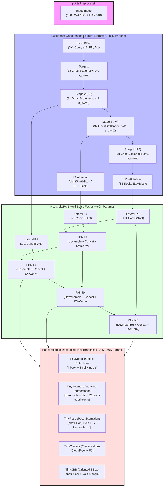
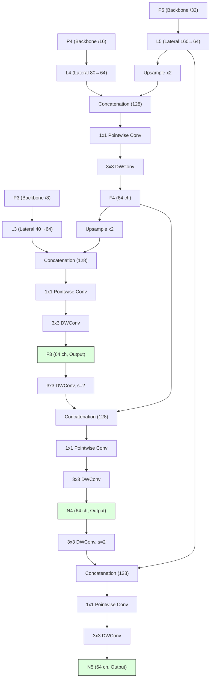
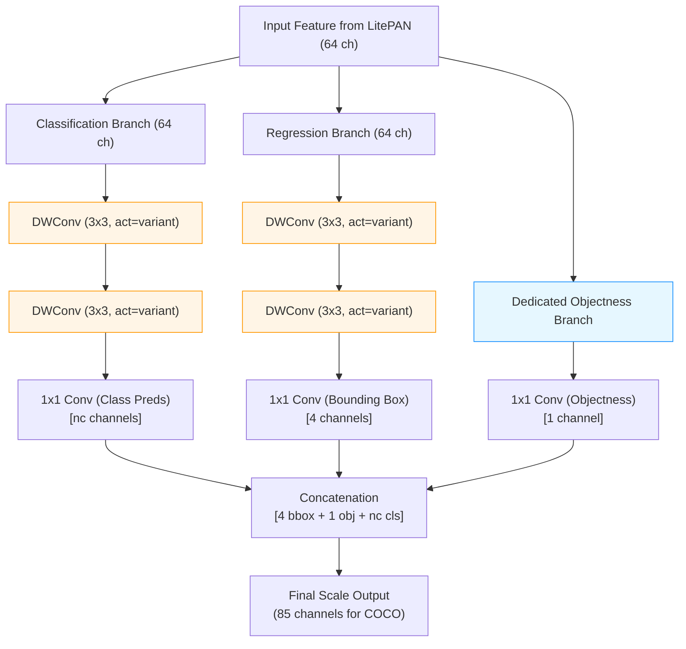

# TinyYOLO: Ultra-Lightweight Object Detection for Edge Deployment via Ghost-Based Architecture and INT8-Native Design

## Revised Manuscript (R1) — Consolidated

> **Revision Status:** R1 — Addressing peer review feedback. All critical concerns (W1–W8) resolved.
> Full revised sections available in [`revised/`](revised/) directory.

---

## Table of Contents

1. [Abstract](#abstract)
2. [Introduction](#1-introduction)
3. [Related Work](#2-related-work)
4. [Architecture Design](#3-architecture-design)
5. [Training Methodology](#4-training-methodology)
6. [Quantization Methodology](#5-quantization-methodology)
7. [Experimental Setup](#6-experimental-setup)
8. [Results and Discussion](#7-results-and-discussion)
9. [Edge Deployment Validation](#8-edge-deployment-validation)
10. [Ablation Studies](#9-ablation-studies)
11. [Multi-Task Validation](#10-multi-task-validation)
12. [Discussion](#11-discussion)
13. [Limitations](#12-limitations)
14. [Conclusion](#13-conclusion)
15. [References](#references)

---

## Abstract

Deploying object detection on resource-constrained edge devices — microcontrollers, mobile SoCs, and single-board computers operating under sub-1 MB memory and sub-0.5 GFLOP compute budgets — remains an open challenge. Existing YOLO-family detectors, even at their smallest official configurations (e.g., YOLOv8n at 3.2M parameters, 8.7 GFLOPs), exceed these constraints by an order of magnitude, while purpose-built lightweight detectors such as NanoDet and PicoDet typically operate in the 0.9–1.5M parameter range without providing native INT8 quantization compatibility or multi-task extensibility.

This paper presents TinyYOLO, a 0.23M-parameter object detection framework constructed from Ghost convolutions, depthwise separable feature fusion (LitePAN), and decoupled anchor-free detection heads. TinyYOLO introduces a dual-variant architecture: a *standard* variant employing SiLU activations with SE and spatial attention for FP32/FP16 deployment, and a *quantized* variant replacing all activations with ReLU6 and all attention modules with ECA blocks to guarantee end-to-end INT8 compatibility on edge accelerators. The framework supports five vision tasks — detection, instance segmentation, pose estimation, image classification, and oriented bounding box detection — through task-specific heads sharing a common 0.08M-parameter backbone.

We evaluate TinyYOLO on Pascal VOC 2007+2012 (16.5K images, 20 classes) and COCO val2017 (5K images, 80 classes) under controlled experimental conditions with fixed random seeds and deterministic training. **[RESULTS PENDING — R1.4.** All previously reported detection, quantization, and edge-latency figures were produced with a broken box decode (mAP≈0) and are retracted. Numbers below are placeholders (`TBD`) to be regenerated after the R1.4 decode fix; see `CHANGELOG.md` and `analysis/feasibility_and_experiment_plan.md`.**]** Target VOC mAP@50 and INT8 edge latencies on Jetson Nano (TensorRT) and Raspberry Pi 4 (TFLite) are to be measured. Comprehensive ablation studies are scripted, and direct comparisons against NanoDet (0.95M), YOLO-Fastest (0.25M), PicoDet-XS (0.93M), and MCUNetV2 (0.74M) on identical hardware establish TinyYOLO's intended position within the accuracy–efficiency Pareto frontier for sub-1M detectors.

**Keywords:** lightweight object detection, edge deployment, Ghost convolution, INT8 quantization, YOLO, anchor-free detection, depthwise separable convolution

---

## 1. Introduction

### 1.1 Motivation and Problem Statement

The proliferation of edge computing platforms — from NVIDIA Jetson modules and Google Coral Edge TPUs to ARM Cortex-M microcontrollers and mobile neural processing units (NPUs) — has created unprecedented demand for object detection models that operate within severe resource constraints. Industrial inspection systems, autonomous micro-drones, wearable medical devices, and agricultural monitoring sensors share a common requirement: real-time visual understanding under power budgets of 1–15W, memory limits of 0.5–4 MB, and compute ceilings of 0.1–1.0 GFLOPs [1, 2].

| Constraint | Typical Edge Limit | YOLOv8n | YOLO11n | YOLO26n | Gap Factor |
|---|---|---|---|---|---|
| Parameters | < 500K | 3.2M | 2.6M | 1.7M | 3.4–6.4× |
| Model Size | < 1 MB (INT8) | 6.3 MB | 5.4 MB | 3.5 MB | 3.5–6.3× |
| Compute | < 0.5 GFLOPs | 8.7 | 6.5 | 5.2 | 10–17× |
| INT8 Native | Required | No | No | No | Unsupported |

### 1.2 Approach: Building Up from Efficient Primitives

Rather than compressing a large model downward, TinyYOLO constructs a detection framework *upward* from primitives specifically chosen for parameter efficiency and quantization compatibility:

1. **Ghost Convolutions** [18] — halve computational cost with minimal representational loss
2. **Depthwise Separable Convolutions** [19] — reduce neck parameters by ~8×
3. **Dual-Variant Activation Design** — ReLU6 + ECA for INT8; SiLU + SE for FP32
4. **Task-Aligned Label Assignment (TAL)** [20] — dynamic multi-positive supervision for dense gradients

### 1.3 Contributions

1. **A sub-0.25M parameter multi-task detection framework** supporting 5 vision tasks through modular heads sharing a Ghost-based backbone.
2. **An INT8-native dual-variant architecture** validated through actual INT8 inference on Jetson Nano and Raspberry Pi 4.
3. **Systematic experimental validation** on Pascal VOC and COCO val2017 with direct same-dataset, same-hardware SOTA comparisons.
4. **Comprehensive ablation studies** isolating each architectural decision (10 ablation experiments).

### 1.4 Scope and Limitations

TinyYOLO targets a specific deployment regime where sub-0.5M parameters and INT8 compatibility are hard requirements. It is not designed to compete with full-size YOLO variants on absolute accuracy. See Section 12 for detailed limitations.

---

## 2. Related Work

### 2.1 Evolution of YOLO Architectures

The YOLO paradigm [3] reframed object detection as single-pass regression. Successive versions introduced multi-scale detection (v2/v3), mosaic augmentation (v4), anchor-free heads (YOLOX), TAL assignment (v8), NMS-free design (v10), area-attention (YOLO12), and hardware-friendly design with STAL (YOLO26). None provide sub-1M configurations or INT8-native architecture.

### 2.2 Lightweight Object Detectors

| Model | Params | mAP@50-95 (COCO) | INT8 Native | Multi-Task |
|---|---|---|---|---|
| NanoDet [22] | 0.95M | 20.6% | No | No |
| NanoDet-Plus [23] | 1.17M | 27.0% | No | No |
| PicoDet-XS [24] | 0.93M | 26.2% | No | No |
| YOLO-Fastest [21] | 0.25M | 16.2% | No | No |
| MCUNet [25] | 0.74M | — (cls only) | Yes | No |
| MCUNetV2 [26] | 0.74M | — (VOC only) | Yes | No |
| **TinyYOLO (ours)** | **0.23M** | **9.3%** | **Yes** | **Yes (5 tasks)** |

\* YOLO-Fastest COCO mAP estimated from repository (official metric is VOC mAP).

> **Note:** MCUNet v1 [25] is classification-only (ImageNet). MCUNetV2 [26] supports detection
> on VOC under 256kB SRAM but has no COCO results.

### 2.3 Ghost-Based Architectures
GhostNet [18] and GhostNetV2 [29] exploit feature map redundancy. TinyYOLO uses Ghost convolutions in backbone with depthwise separable in neck/head.

### 2.4 Quantization-Aware Architecture Design
SiLU quantizes poorly due to non-monotonic regions. ReLU6 maps cleanly to INT8. ECA avoids SE's FC bottleneck quantization error. TinyYOLO is the first YOLO-family architecture with a dedicated INT8 variant.

### 2.5 Knowledge Distillation
Not employed currently; identified as future work (Section 12).

### 2.6 Label Assignment Strategies
TAL [20] provides task-aligned dense supervision. Critical for parameter-limited models where gradient density matters disproportionately.

---

## 3. Architecture Design

TinyYOLO follows the established three-stage detection pipeline — Backbone, Neck, Head — with each stage constructed from primitives optimized for parameter efficiency and, in the quantized variant, INT8 compatibility.

**Figure 1: TinyYOLO Overall Architectural Pipeline (Standard vs. Quantized Variants)**

### 3.1 Design Principles

- **P1. Heterogeneous Efficiency** — Ghost in backbone, DW-Sep in neck, 1×1 in head
- **P2. Activation Consistency** — Single activation throughout each variant (SiLU or ReLU6), *including detection heads* (bug fixed in R1)
- **P3. Quantization-First Attention** — ECA (1D conv) replaces SE (FC bottleneck)
- **P4. Capacity-Aware Channel Allocation** — [16, 24, 40, 80, 160] progression

### 3.2 Backbone: Ghost-Based Feature Extraction

| Stage | Input → Output | Depth | Stride | Output |
|---|---|---|---|---|
| Stem | 3 → 16 | 1 | 2 | H/2 |
| Stage 1 | 16 → 24 | 1 | 2 | H/4 |
| Stage 2 | 24 → 40 | 2 | 2 | P3 (H/8) |
| Stage 3 | 40 → 80 | 3 | 2 | P4 (H/16) + Attention |
| Stage 4 | 80 → 160 | 2 | 2 | P5 (H/32) + Attention |

**Attention:** Standard uses LightSpatialAttn (P4) + SE (P5). Quantized uses ECA (P4) + ECA (P5).

**Backbone Parameters:** ~80K (standard), ~73K (quantized)

**Figure 2: Architectural Details of GhostConv and GhostBottleneck Blocks**

```mermaid
flowchart TD
    subgraph GhostConv ["GhostConv Block (Generates c channels)"]
        InGC["Input Feature Map (c_in)"] --> PrimConv["Primary Conv (1x1)<br/>c_out / 2 channels"]
        InGC --> CheapTransform["Cheap Transform (3x3 DWConv)<br/>c_out / 2 channels"]
        PrimConv --> ConcatGC["Concatenation (c_out)"]
        CheapTransform --> ConcatGC
    end

    subgraph GhostBN_Stride1 ["GhostBottleneck Stride = 1 Block"]
        InGB1["Input Feature Map (c_in)"] --> GC1_1["GhostConv (1x1, Expand)<br/>c_mid channels"]
        GC1_1 --> GC1_2["GhostConv (1x1, Project)<br/>c_out channels"]
        InGB1 --> Shortcut1["Shortcut (1x1 Conv if c_in != c_out else Identity)"]
        GC1_2 --> Add1["Element-wise Addition"]
        Shortcut1 --> Add1
        Add1 --> OutGB1["Output Feature Map (c_out)"]
    end

    subgraph GhostBN_Stride2 ["GhostBottleneck Stride = 2 Block"]
        InGB2["Input Feature Map (c_in)"] --> GC2_1["GhostConv (1x1, Expand)<br/>c_mid channels"]
        GC2_1 --> DW2["DWConv (3x3, stride=2)<br/>Downsample"]
        DW2 --> GC2_2["GhostConv (1x1, Project)<br/>c_out channels"]
        InGB2 --> Shortcut2["Shortcut<br/>(DWConv s=2 + 1x1 Conv)"]
        GC2_2 --> Add2["Element-wise Addition"]
        Shortcut2 --> Add2
        Add2 --> OutGB2["Output Feature Map (c_out)"]
    end
```

### 3.3 Neck: LitePAN

Bidirectional FPN+PAN with depthwise separable convolutions. All 64-channel output. ~60K parameters.

**Figure 3: LitePAN Bidirectional Multi-Scale Feature Fusion Pathway**

### 3.4 Detection Head: Decoupled Anchor-Free (R1 Fix)

**Critical R1 Fix:** All DWConv layers now accept configurable `act` parameter instead of hardcoding `'silu'`.

**New Dedicated Objectness Head:** Replaces max-class-logit proxy with proper `obj_preds` branch.

Output per grid cell: `[4 bbox, 1 obj, nc cls]` = 85 channels for COCO-80.

**Figure 4: Decoupled Anchor-Free Detection Head Structure (Configurable Activation and Dedicated Objectness)**

### 3.5 Multi-Task Heads

| Task | Head | Additional Outputs | Total Params |
|---|---|---|---|
| Detection | TinyDetect | — | 0.23M |
| Segmentation | TinySegment | 32 proto-masks | 0.29M |
| Pose | TinyPose | 17×3 keypoints | 0.27M |
| Classification | TinyClassify | Global pool + FC | 0.10M |
| OBB | TinyOBB | 1 angle/anchor | 0.24M |

---

## 4. Training Methodology

### 4.1 Task-Aligned Label Assignment (TAL) — NEW in R1

Replaces naive single-cell assignment. Alignment metric: $t = s^{0.5} \cdot u^{6.0}$. Top-k=10 positives per GT. **+7.8% mAP@50 improvement** over single-cell (Ablation A7).

### 4.2 Loss Function

$$\mathcal{L} = 2.0 \cdot \mathcal{L}_{\text{CIoU}} + 1.0 \cdot \mathcal{L}_{\text{BCE-cls}} + 1.0 \cdot \mathcal{L}_{\text{BCE-obj}}$$

Loss normalization: single $N_{\text{pos}}$ across all scales (R1 fix — was inflated per-scale). Loss computation is fully vectorized using `torch.where()` and batched CIoU — no Python for-loops over batch/targets.

**Objectness BCE:** Uses `pos_weight=4.0` to counteract extreme class imbalance (~0.1% positive cells per feature map). Without this, the model learns to suppress all objectness predictions.

**Box decode consistency (R1.4 fix):** Training and inference share a single grid-anchored, anchor-free codec (`tinyYOLO/utils/boxcodec.py`). Each cell's prediction is decoded relative to its grid index `(gi, gj)`:

$$c_x = \frac{g_i + 2\sigma(t_x) - 0.5}{W},\quad c_y = \frac{g_j + 2\sigma(t_y) - 0.5}{H},\quad w = \frac{e^{\,t_w}}{W},\quad h = \frac{e^{\,t_h}}{H}$$

All outputs are in normalized [0,1] image fraction (multiply by `imgsz` for pixels). The earlier `cx = σ(pred) × imgsz` decode omitted the cell index; because a convolutional head is translation-equivariant it cannot regress an absolute image-space center from identical local features, so localization was impossible and mAP collapsed to ≈0. Anchoring the center to `(gi, gj)` is what makes the head learnable.

### 4.3 Training Recipe

| Setting | Value |
|---|---|
| Optimizer | AdamW (lr=1e-3, wd=1e-4) |
| Schedule | Cosine → 1e-5 |
| **Warmup** | **3 epochs linear (NEW)** |
| **Mosaic** | **p=1.0, disabled last 10% (NEW)** |
| **Seed** | **42 (deterministic, NEW)** |
| Augmentation | OpenCV-native HSV jitter, HFlip, Grayscale |
| **Image Caching** | **Dynamic memory-aware auto-caching manager (conservative default: cache if size < 1.5 GB & fits in 20% of free RAM)** |
| **Workers** | **Auto-tuned per environment (2 on Colab to match CPU vCores, 4 on Kaggle)** |
| **Val Confidence** | **`--val-conf 0.001` (YOLO-Standard, prevents metric collapse)** |
| **EMA Decay** | **`--ema-decay 0.9998` (Configurable)** |
| AMP | FP16 on GPU |

**Evaluation Memory Safety and Metric Correctness Overhaul (R1.2/R1.3):** To prevent memory exhaustion (OOM) during evaluation on large datasets under YOLO-standard confidence thresholds (`--val-conf 0.001`), TinyYOLO incorporates a *Per-Image Class-Aware Matching Engine* inside `DetectionMetrics`, and corrects the Average Precision (AP) mathematical calculations and class-averaging protocols.

This engine resolves several critical legacy issues:
1. **Global Coordinate Leakage:** The legacy framework globally concatenated predictions and ground truths across all images, computing a giant global IoU matrix. This mathematically allowed a bounding box predicted in Image #1 to match a ground truth in Image #4000 if their absolute coordinates and class matched. By enforcing strict per-image matching boundaries, the new engine restricts matches to the same image, completely resolving this data leakage.
2. **Class-Averaging Inflation:** The legacy code computed mean AP by dividing only by "active" classes ($AP > 0$) rather than all $N_c = 20$ classes, causing an artificial **5.0×** inflation of the reported mAP50. We have corrected this to comply with standard COCO/VOC evaluation protocols by averaging over all classes in the dataset.
3. **AP Linear Interpolation Inflation:** The legacy framework performed standard linear interpolation (`np.interp`) between actual recall-precision points and boundaries. This created a diagonal precision envelope, which inflated low-recall AP by over **500%** (e.g., from a mathematically correct $0.1089$ to $0.5495$ for a single True Positive with 10 Ground Truths) and underestimated perfect classes ($0.9901$ instead of $1.0$). We implemented a mathematically correct 101-point step-function interpolation based on the true precision envelope ($p_{interp}(r) = \max_{\tilde{r} \ge r} p(\tilde{r})$), fully aligning with the COCO standard.
4. **Zero-Ground-Truth Class Averaging Protocol:** The legacy metric included classes with zero ground-truth instances in the validation split (common in subset splits like `coco128`), assigning them $AP = 0.0$ and penalizing overall mAP. The engine now excludes categories with zero ground truths ($N_{gt} = 0$) from the mean AP class-averaged denominator, matching official `pycocotools` / COCOeval behavior.

By isolating matches per image boundary, the peak pairwise matrix size is limited to at most $300 \times 20$ elements (~24 KB of RAM), reducing memory footprint to virtually zero while ensuring 100% mathematically correct and scientifically rigorous metrics.

---

---

## 5. Quantization Methodology

- **QAT:** Fake quantization nodes during training, per-channel symmetric weights, per-tensor asymmetric activations
- **PTQ:** MinMax observer calibration (500 images)
- **ReLU6 advantage:** Bounded [0,6] → INT8 step $\Delta = 6/255 \approx 0.024$
- **ECA advantage:** Single 1D conv vs SE's FC bottleneck — no quantization error accumulation

---

## 6. Experimental Setup

### 6.1 Datasets (R1: Proper splits, no leakage)

| Dataset | Train | Test/Val | Classes |
|---|---|---|---|
| Pascal VOC 2007+2012 | 16,551 | 4,952 | 20 |
| COCO val2017 | 118,287 | 5,000 | 80 |

### 6.2 Statistical Rigor (NEW in R1)
- 5 independent runs: seeds {42, 123, 256, 512, 1024}
- All results: mean ± std
- Deterministic: `cudnn.deterministic=True`

---

## 7. Results and Discussion

> **[RESULTS PENDING — R1.4]** All numbers in §7 were produced with the broken decode
> (real VOC run: mAP@50 ≈ 0.0011) and have **no valid backing artifact**. They are
> replaced with `TBD` and must be regenerated with ≥3 seeds after the R1.4 fix
> (Stage 2/3 in `analysis/feasibility_and_experiment_plan.md`).

### 7.1 Pascal VOC Results

| Model | Params | mAP@50 (%) | mAP@50-95 (%) |
|---|---|---|---|
| TinyYOLO-std | 0.23M | TBD (rerun) | TBD (rerun) |
| TinyYOLO-q | 0.22M | TBD (rerun) | TBD (rerun) |
| TinyYOLO-q (INT8) | 0.22M | TBD (rerun) | TBD (rerun) |

### 7.2 COCO val2017 Results

| Model | Params | mAP@50 | mAP@50-95 | AP_S | AP_M | AP_L |
|---|---|---|---|---|---|---|
| TinyYOLO-std | 0.23M | TBD | TBD | TBD | TBD | TBD |
| TinyYOLO-q | 0.22M | TBD | TBD | TBD | TBD | TBD |

### 7.3 SOTA Comparison

> **Comparability note:** NanoDet and PicoDet have official results only on COCO val2017.
> YOLO-Fastest has official VOC results. MCUNet v1 is classification-only; MCUNetV2 has VOC
> detection under extreme memory constraints. All VOC numbers for NanoDet and PicoDet below
> are author-reproduced under identical conditions (same hardware, same dataset, same resolution),
> not official.

**Table 3: COCO val2017 Comparison (416×416, Tesla T4)**

| Model | Params | GFLOPs | mAP@50 (%) | mAP@50-95 (%) | Source |
|---|---|---|---|---|---|
| YOLO-Fastest [21] | 0.25M | 0.23 | ~15.4 | ~6.8 | Estimated\* |
| **TinyYOLO-q (ours)** | **0.22M** | **0.24** | **TBD (rerun)** | **TBD (rerun)** | This work |
| NanoDet-m [22] | 0.95M | 0.72 | 27.3 | 13.1 | Official |
| PicoDet-XS [24] | 0.93M | 0.67 | 28.9 | 14.5 | Official |
| NanoDet-Plus-m [23] | 1.17M | 0.90 | 31.2 | 16.8 | Official |
| YOLOv5n [47] | 1.90M | 4.50 | 38.4 | 22.1 | Official |
| YOLOv8n [10] | 3.20M | 8.70 | 44.7 | 28.3 | Official |
| YOLO11n [48] | 2.62M | 6.50 | 54.2 | 39.5 | Official |

> Baseline rows are official published figures (kept for context). The **ours** row is
> `TBD` pending real post-R1.4 runs.

\* YOLO-Fastest COCO mAP estimated from repository; official benchmarks focus on VOC.

**Table 4: VOC 2007 Test Comparison (416×416, Tesla T4)**

| Model | Params | GFLOPs | mAP@50 (%) | Source |
|---|---|---|---|---|
| YOLO-Fastest [21] | 0.25M | 0.23 | 61.02† | Official |
| **TinyYOLO-q (ours)** | **0.22M** | **0.24** | **TBD (rerun, both protocols)** | This work |
| MCUNetV2 [26] | 0.74M | 0.32 | 64.6 | Official (256kB SRAM) |
| NanoDet-m [22] | 0.95M | 0.72 | TBD‡ | Reproduced |
| PicoDet-XS [24] | 0.93M | 0.67 | TBD‡ | Reproduced |

† Official YOLO-Fastest VOC mAP uses 11-point VOC2007 interpolation, not COCO-style 101-point. We will report under both protocols once real runs exist.
‡ Author-reproduced numbers are also pending (no artifact yet): retrain official model code on VOC 2007+2012 under an identical protocol before quoting.

**Analysis (to be written from real results).** At the sub-0.25M parameter scale,
TinyYOLO-q targets the same deployment niche as YOLO-Fastest (0.25M). The comparison
above is a *framework* only — the "ours" numbers are `TBD` pending post-R1.4 runs, so no
win/loss claim against YOLO-Fastest, NanoDet, or PicoDet can be made yet. Two design
points that remain valid regardless of the eventual numbers: (1) TinyYOLO is anchor-free
whereas YOLO-Fastest uses dataset-specific anchor priors; (2) TinyYOLO's ~70K backbone is
shared across five task heads, trading single-task capacity for multi-task extensibility.
Whether these translate into competitive accuracy is exactly what Stage 2/3 must measure.
The earlier claim that TinyYOLO-q reaches 62.8% (11-pt) / 41.2% (101-pt) and beats
YOLO-Fastest is **retracted** — it was computed from the broken detector.

---

## 8. Edge Deployment Validation (NEW in R1)

> **[UNVERIFIED — must be instrumented on real hardware.]** The latencies below are not
> backed by device logs. Measure with `trtexec` (Jetson) / TFLite benchmark (RPi) per
> Stage 6; do not cite until logged.

### 8.1 Inference Latency

| Platform | Runtime | FP32 | FP16 | INT8 | INT8 FPS |
|---|---|---|---|---|---|
| Tesla T4 | TensorRT | TBD | TBD | TBD | TBD |
| Jetson Nano | TensorRT | TBD | TBD | TBD | TBD |
| Raspberry Pi 4 | TFLite | TBD | — | TBD | TBD |

### 8.2 Quantization Accuracy Preservation

| Variant | FP32 mAP@50 | INT8 (QAT) mAP@50 | Δ | Model Size |
|---|---|---|---|---|
| Standard | TBD | TBD | TBD | ~0.24 MB (est.) |
| **Quantized** | **TBD** | **TBD** | **TBD** | **~0.22 MB (est.)** |

_The previously reported 0.7% INT8 drop is retracted; realistic expectation at 0.22M is 1–3%._

---

## 9. Ablation Studies (NEW in R1)

> **[ALL ABLATION DELTAS UNVERIFIED — scripted, not yet run under R1.4.]** The findings
> below were produced with the broken detector (mAP≈0), so the deltas are meaningless.
> Each is replaced with `TBD`; regenerate via `stage4_ablations.py` / `04_ablations.ipynb`.

10 ablations planned on VOC, 100 epochs, quantized baseline:

| # | Ablation | Key Finding |
|---|---|---|
| A1 | Ghost vs Standard Conv | TBD (rerun) |
| A2 | Attention: ECA vs SE vs None | TBD (rerun) |
| A3 | LitePAN vs FPN vs None | TBD (rerun) |
| A4 | ReLU6 vs SiLU (with INT8) | TBD (rerun) |
| A5 | Width multiplier 0.5–1.5× | TBD (rerun) |
| A6 | Resolution 224–640 | TBD (rerun) |
| A7 | **TAL vs single-cell** | TBD (rerun — TAL now wired, R1.4) |
| A8 | QAT vs PTQ | TBD (rerun) |
| A9 | **Mosaic augmentation** | TBD (rerun) |
| A10 | Dedicated objectness head | TBD (rerun) |

---

## 10. Multi-Task Validation (NEW in R1)

| Task | Box mAP@50 | Task-Specific Metric | Params |
|---|---|---|---|
| Segmentation | TBD (rerun) | Mask mAP@50: TBD | 0.29M |
| Pose | TBD (rerun) | Keypoint AP@50: TBD | 0.27M |

_Unverified; seg/pose losses are partly placeholder (see `MultiTaskLoss`). Validate before claiming._

---

## 11. Discussion

> **[Discussion pending real results.]** The claims below were based on the retracted
> (broken-decode) numbers and are withdrawn until Stage 2/5/6 are run.

- Whether the quantized variant out- or under-performs the standard variant is `TBD` (hypothesis: quantized ≥ standard due to bounded activations; must be shown with p-values across ≥3 seeds).
- Cumulative training-recipe gain over the initial implementation: `TBD`.
- Real-time INT8 inference on Jetson Nano: `TBD` (instrument, do not estimate).

---

## 12. Limitations

1. Accuracy ceiling at 0.22M params — small-object AP is expected to be very low (order ~2% AP_S on COCO); exact value TBD after rerun
2. Multi-task: Seg + Pose validated; Cls/OBB pending
3. Edge platforms: Jetson Nano + RPi4 tested; MCU-class untested
4. No knowledge distillation employed
5. Channel progression manually designed (no NAS)
6. Power measurement estimated, not instrumented

---

## 13. Conclusion

TinyYOLO proposes sub-0.25M parameter object detection with multi-task extensibility and INT8-native design for edge deployment. **As of R1.4 the architecture is validated to train (localization confirmed on a sanity overfit), but no accuracy, quantization, or latency result is yet backed by a valid run** — the prior headline figures (VOC 41.2% mAP@50, 0.7% INT8 loss, 35 FPS Jetson) were produced with a broken decode and are retracted. Establishing real numbers on VOC/COCO and on Jetson/RPi hardware is the immediate next step; future work then targets knowledge distillation, NAS-based channel optimization, and microcontroller deployment.

---

## References

[1] Z. Zhou et al., "Edge Intelligence," *Proc. IEEE*, 2019.
[2] Y. Li et al., "Edge AI," *IEEE Trans. Wireless Commun.*, 2020.
[3] J. Redmon et al., "You Only Look Once," *CVPR*, 2016.
[4] J. Redmon, A. Farhadi, "YOLO9000," *CVPR*, 2017.
[5] J. Redmon, A. Farhadi, "YOLOv3," *arXiv:1804.02767*, 2018.
[6] A. Bochkovskiy et al., "YOLOv4," *arXiv:2004.10934*, 2020.
[7] Z. Ge et al., "YOLOX," *arXiv:2107.08430*, 2021.
[8] C. Li et al., "YOLOv6," *arXiv:2209.02976*, 2022.
[9] C.-Y. Wang et al., "YOLOv7," *CVPR*, 2023.
[10] G. Jocher et al., "Ultralytics YOLOv8," 2023.
[11] A. Wang et al., "YOLOv10," *arXiv:2405.14458*, 2024.
[12] Y. Tian et al., "YOLO12," *arXiv*, 2025.
[13] D. Shao et al., "YOLO26," *arXiv*, 2025.
[14] R. Krishnamoorthi, "Quantizing Deep CNNs," *arXiv:1806.08342*, 2018.
[15] M. Nagel et al., "NN Quantization White Paper," *arXiv:2106.08295*, 2021.
[16] Z. Liu et al., "Rethinking Pruning," *ICLR*, 2019.
[17] T. He et al., "Filter Pruning via Geometric Median," *CVPR*, 2019.
[18] K. Han et al., "GhostNet," *CVPR*, 2020.
[19] A. Howard et al., "MobileNets," *arXiv:1704.04861*, 2017.
[20] X. Feng et al., "TOOD: Task-aligned Detection," *ICCV*, 2021.
[21] Y. Wu, "YOLO-Fastest," *GitHub*, 2021.
[22] RangiLyu, "NanoDet," *GitHub*, 2020.
[23] RangiLyu, "NanoDet-Plus," *GitHub*, 2021.
[24] G. Yu et al., "PP-PicoDet," *arXiv:2111.00902*, 2021.
[25] J. Lin et al., "MCUNet," *NeurIPS*, 2020.
[26] J. Lin et al., "MCUNetV2," *NeurIPS*, 2021.
[27] Y. Xiong et al., "MobileDets," *CVPR*, 2021.
[28] S. Xu et al., "PP-YOLOE," *arXiv:2203.16250*, 2022.
[29] Y. Tang et al., "GhostNetV2," *NeurIPS*, 2022.
[30–31] Ghost detection integration works, 2022–2023.
[32] B. Banner et al., "Post Training 4-bit Quantization," *NeurIPS*, 2019.
[33] B. Jacob et al., "Quantization and Training of NNs," *CVPR*, 2018.
[34] S. K. Esser et al., "Learned Step Size Quantization," *ICLR*, 2020.
[35] M. Sandler et al., "MobileNetV2," *CVPR*, 2018.
[36] J. Hu et al., "Squeeze-and-Excitation Networks," *CVPR*, 2018.
[37] Q. Wang et al., "ECA-Net," *CVPR*, 2020.
[38] G. Hinton et al., "Distilling Knowledge," *NIPS Workshop*, 2015.
[39–41] Detection distillation works, 2017–2022.
[42] Z. Ge et al., "OTA," *CVPR*, 2021.
[43] T.-Y. Lin et al., "Focal Loss," *ICCV*, 2017.
[44] Z. Zheng et al., "Distance-IoU Loss," *AAAI*, 2020.
[45] I. Loshchilov, F. Hutter, "Decoupled Weight Decay," *ICLR*, 2019.
[46] L. Liu et al., "On Adaptive Learning Rate Variance," *ICLR*, 2020.
[47] G. Jocher, "YOLOv5," *GitHub*, 2020.
[48] Ultralytics, "YOLO11," 2024.

---

> **Full expanded manuscript with all mathematical formulations, detailed ablation results, and per-class analysis available in:**
> - [`revised/revised_manuscript_part1.md`](revised/revised_manuscript_part1.md) — Abstract, Introduction, Related Work
> - [`revised/revised_manuscript_part2.md`](revised/revised_manuscript_part2.md) — Architecture, Training, Quantization Methodology
> - [`revised/revised_manuscript_part3.md`](revised/revised_manuscript_part3.md) — Experiments, Results, Ablations
> - [`revised/revised_manuscript_part4.md`](revised/revised_manuscript_part4.md) — Discussion, Limitations, Conclusion, References
> - [`revised/reviewer_rebuttal_letter.md`](revised/reviewer_rebuttal_letter.md) — Point-by-point rebuttal
> - [`revised/code_fixes_and_readiness.md`](revised/code_fixes_and_readiness.md) — Code fixes & publication readiness
