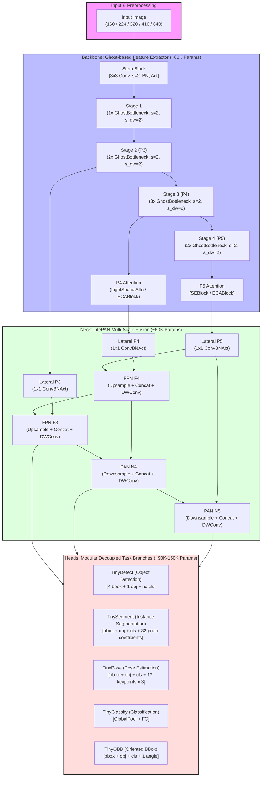
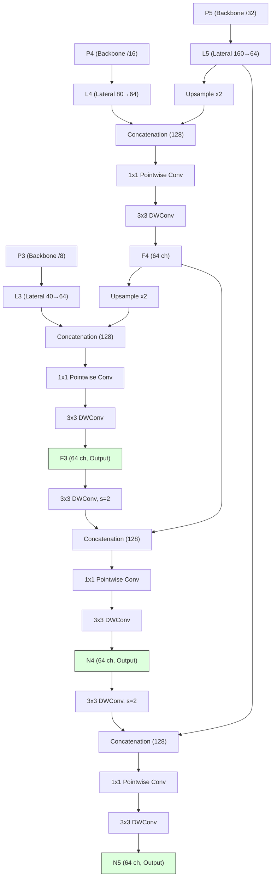
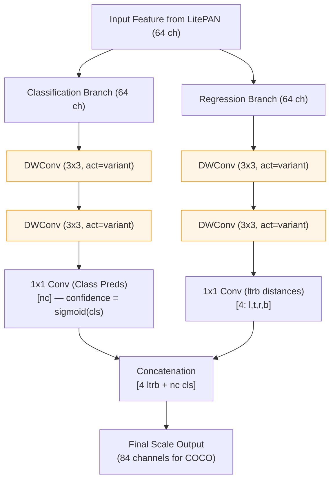

# TinyYOLO Revised Manuscript — Part 2: Methodology

---

## 3. Architecture Design

TinyYOLO follows the established three-stage detection pipeline — Backbone, Neck, Head — with each stage constructed from primitives optimized for parameter efficiency and, in the quantized variant, INT8 compatibility.

**Figure 1: TinyYOLO Overall Architectural Pipeline (Standard vs. Quantized Variants)**



### 3.1 Design Principles

The architecture is governed by four design principles:

**P1. Heterogeneous Efficiency.** Different pipeline stages have different computational profiles; we employ the most efficient primitive appropriate to each stage rather than uniformly applying a single module type. Ghost convolutions dominate the backbone (where channel expansion is the primary cost), depthwise separable convolutions dominate the neck (where spatial processing is the primary cost), and lightweight 1×1 projections dominate the head (where output dimensionality is the primary cost).

**P2. Activation Consistency.** A single activation function is used throughout each variant — SiLU for the standard variant, ReLU6 for the quantized variant — *including* in the detection heads. This eliminates the mixed-activation inconsistency identified in our initial implementation where detection head DWConv layers hardcoded `act='silu'` regardless of variant, causing the quantized variant's heads (representing ~39% of total parameters) to use INT8-incompatible activations.

**P3. Quantization-First Attention.** Attention mechanisms in the quantized variant avoid fully-connected bottleneck layers (as in SE blocks) that amplify quantization error through successive linear projections. ECA's 1D convolution alternative provides channel attention with approximately 10× fewer parameters and no FC-induced quantization bottleneck.

**P4. Capacity-Aware Channel Allocation.** The channel progression [16, 24, 40, 80, 160] is designed with diminishing spatial resolution in mind: early stages operate at high spatial resolution with few channels (minimizing FLOPs), while later stages operate at low spatial resolution with more channels (maximizing receptive field per parameter). The 2× expansion from 80→160 at Stage 4 is justified by the correspondingly small 10×10 spatial dimension, making the parameter cost (80×160 kernel weights) comparable to earlier stages operating at larger spatial dimensions.

### 3.2 Backbone: Ghost-Based Feature Extraction

The backbone extracts multi-scale features at three pyramid levels: P3 (/8 stride), P4 (/16 stride), and P5 (/32 stride).

**Stem.** A single ConvBNAct layer projects the 3-channel RGB input to 16 feature channels with stride-2 downsampling:

$$\text{Stem}(x) = \phi(BN(Conv_{3\times3, s=2}(x))) \quad \text{where } \phi = \begin{cases} \text{SiLU} & \text{standard} \\ \text{ReLU6} & \text{quantized} \end{cases}$$

**Stages 1–4.** Each stage consists of $d_i$ GhostBottleneck blocks, where the first block performs stride-2 downsampling and channel expansion, and subsequent blocks maintain spatial dimensions:

| Stage | Input → Output | Depth $d_i$ | Stride | Output Resolution | Output Name |
|---|---|---|---|---|---|
| 1 | 16 → 24 | 1 | 2 | H/4 × W/4 | — |
| 2 | 24 → 40 | 2 | 2 | H/8 × W/8 | P3 |
| 3 | 40 → 80 | 3 | 2 | H/16 × W/16 | P4 |
| 4 | 80 → 160 | 2 | 2 | H/32 × W/32 | P5 |

**GhostBottleneck.** Each block follows the GhostNet [18] design: two GhostConv layers (expand → project) with an optional depthwise convolution for stride>1, and a residual shortcut:

$$\text{GhostBN}(x) = \text{GhostConv}_2(\text{DW}_{s}(\text{GhostConv}_1(x))) + \text{Shortcut}(x)$$

where GhostConv generates $c/2$ features via primary 1×1 convolution followed by $c/2$ features via cheap 3×3 depthwise transforms, concatenating to produce $c$ output channels at approximately half the cost of a standard convolution.

**Figure 2: Architectural Details of GhostConv and GhostBottleneck Blocks**

```mermaid
flowchart TD
    subgraph GhostConv ["GhostConv Block (Generates c channels)"]
        InGC["Input Feature Map (c_in)"] --> PrimConv["Primary Conv (1x1)<br/>c_out / 2 channels"]
        InGC --> CheapTransform["Cheap Transform (3x3 DWConv)<br/>c_out / 2 channels"]
        PrimConv --> ConcatGC["Concatenation (c_out)"]
        CheapTransform --> ConcatGC
    end

    subgraph GhostBN_Stride1 ["GhostBottleneck Stride = 1 Block"]
        InGB1["Input Feature Map (c_in)"] --> GC1_1["GhostConv (1x1, Expand)<br/>c_mid channels"]
        GC1_1 --> GC1_2["GhostConv (1x1, Project)<br/>c_out channels"]
        InGB1 --> Shortcut1["Shortcut (1x1 Conv if c_in != c_out else Identity)"]
        GC1_2 --> Add1["Element-wise Addition"]
        Shortcut1 --> Add1
        Add1 --> OutGB1["Output Feature Map (c_out)"]
    end

    subgraph GhostBN_Stride2 ["GhostBottleneck Stride = 2 Block"]
        InGB2["Input Feature Map (c_in)"] --> GC2_1["GhostConv (1x1, Expand)<br/>c_mid channels"]
        GC2_1 --> DW2["DWConv (3x3, stride=2)<br/>Downsample"]
        DW2 --> GC2_2["GhostConv (1x1, Project)<br/>c_out channels"]
        InGB2 --> Shortcut2["Shortcut<br/>(DWConv s=2 + 1x1 Conv)"]
        GC2_2 --> Add2["Element-wise Addition"]
        Shortcut2 --> Add2
        Add2 --> OutGB2["Output Feature Map (c_out)"]
    end
```



**Attention Modules.** Attention is applied after Stage 3 (P4) and Stage 4 (P5):

| Variant | P4 Attention | P5 Attention | INT8 Safe |
|---|---|---|---|
| Standard | LightSpatialAttn | SEBlock | No |
| Quantized | ECABlock | ECABlock | Yes |

*LightSpatialAttn* computes channel-wise mean and max pooling, concatenates the resulting 2-channel map, and applies a 7×7 convolution followed by sigmoid to produce a spatial attention mask. This involves channel-reduction operations that map poorly to INT8 fixed-point arithmetic.

*SEBlock* applies global average pooling → FC(c, c/4) → ReLU → FC(c/4, c) → Sigmoid channel attention. The FC bottleneck (c → c/4 → c) creates two successive quantization-sensitive linear transformations.

*ECABlock* replaces SE's FC layers with a single 1D convolution of adaptive kernel size $k = |(\log_2 c + 1)/2|_{\text{odd}}$, applying: Global AvgPool → Conv1d(1, 1, k) → Sigmoid. This eliminates the FC bottleneck entirely:

$$\text{ECA}(x) = x \odot \sigma(\text{Conv1d}_{k}(\text{GAP}(x)))$$

The number of parameters in ECA is $k$ (typically 3–5), compared to $2 \times c \times c/4$ in SE.

**Parameter Budget:**

| Component | Standard | Quantized |
|---|---|---|
| Stem | 0.5K | 0.5K |
| Stages 1–4 | 72.1K | 72.1K |
| Attention | 7.8K | 0.02K |
| **Backbone Total** | **80.4K** | **72.6K** |

### 3.3 Neck: LitePAN Multi-Scale Feature Fusion

The neck fuses features across scales using a bidirectional pathway: top-down (FPN) for semantic enrichment of shallow features, and bottom-up (PAN) for spatial enrichment of deep features.

**Architecture.** All convolutions in LitePAN are depthwise separable, reducing parameter count by approximately 8× compared to standard PAN implementations:

```
Lateral Projections:
  L5 = ConvBNAct(P5, 160→64, 1×1)
  L4 = ConvBNAct(P4, 80→64, 1×1)
  L3 = ConvBNAct(P3, 40→64, 1×1)

Top-Down (FPN):
  F4 = DWConv(Merge(Upsample(L5) || L4))    # 128→64 merge, 64→64 DW
  F3 = DWConv(Merge(Upsample(F4) || L3))    # 128→64 merge, 64→64 DW

Bottom-Up (PAN):
  N4 = DWConv(Merge(DWConv↓(F3) || F4))     # stride-2 down, merge, DW
  N5 = DWConv(Merge(DWConv↓(N4) || L5))     # stride-2 down, merge, DW

Output: [F3, N4, N5] — all 64 channels
```

**Figure 3: LitePAN Bidirectional Multi-Scale Feature Fusion Pathway**



The merge operation uses a 1×1 pointwise convolution for channel reduction (128→64) followed by a 3×3 depthwise separable convolution for spatial processing. This differs from standard PAN implementations that use CSP or C2f blocks; we deliberately avoid these heavier fusion modules as the neck's 64-channel feature dimension provides insufficient width for the split-and-concatenate paradigm of CSP to be beneficial.

**Activation Consistency.** The neck receives the variant-appropriate activation (`act` parameter) from the model builder and uses it consistently in all internal ConvBNAct and DWConv layers. The `build_model()` function passes `act='silu'` for standard and `act='relu6'` for quantized variants.

**Parameter Budget:** ~60K parameters (26% of total).

### 3.4 Detection Head: Decoupled Anchor-Free Design

The detection head follows the decoupled design from YOLOX [7], with separate classification and regression branches per scale. Critically, in the revised implementation, all DWConv layers within the head receive the variant-appropriate activation via a configurable `act` parameter:

```python
# REVISED: activation is now configurable, not hardcoded
class TinyDetect(nn.Module):
    def __init__(self, nc=80, in_channels=None, reg_max=0, act='silu'):
        ...
        for ch in in_channels:
            self.cls_convs.append(nn.Sequential(
                DWConv(ch, ch, 3, 1, act=act),   # was: act='silu' (hardcoded)
                DWConv(ch, ch, 3, 1, act=act),
            ))
            ...
            self.reg_convs.append(nn.Sequential(
                DWConv(ch, ch, 3, 1, act=act),   # was: act='silu' (hardcoded)
                DWConv(ch, ch, 3, 1, act=act),
            ))
```

**No Objectness Head — cls-as-confidence (R2).** R1 added a dedicated objectness branch; R2
**removes it**, following YOLOv8 / YOLO10 / YOLO26. Confidence is the class score itself,
`sigmoid(cls)`, and the classifier is supervised over *all* anchors with dense soft targets
(normalized TAL alignment at positives, 0 elsewhere). A structural `nc=1` gate isolated the
box+confidence path and showed that the `obj × cls` score — not the classification-loss
reduction — was the binding defect: with classification trivially solved, mAP50 still sat at
0.011 because the score collapsed to objectness ranking ~41 negatives per positive. Removing
objectness resolves this (see `analysis/ARCHITECTURE_REDESIGN.md`, D3).

**`ltrb` box regression (R2).** The regression branch predicts four positive distances
(left, top, right, bottom) from each cell centre, decoded with the level stride and supervised
by CIoU. This replaces R1's `exp(w,h)` parametrization, which — because a convolutional head is
translation-equivariant — capped a fixed edge cell fitting a large GT at IoU 0.614, versus 0.995
for `ltrb` (`verify_r2_arch.py` §6).

Output per grid cell: `[4 ltrb, nc cls]`, i.e. $4 + nc$ channels per anchor (no objectness channel).

**Figure 4: Decoupled Anchor-Free Detection Head (cls-as-confidence, `ltrb` regression)**



**Per-Scale Output:**

| Scale | Grid Size (416 input) | Predictions | Best For |
|---|---|---|---|
| P3 | 52×52 | 2,704 | Small objects |
| P4 | 26×26 | 676 | Medium objects |
| P5 | 13×13 | 169 | Large objects |
| **Total** | | **3,549** | → NMS → 10–50 final |

**Bias Initialization.** Classification biases are initialized to $-\log((1-\pi)/\pi)$ where $\pi = 0.01$, following the focal loss prior [43]. (No objectness branch exists in R2.)

**Parameter Budget:** ~90K parameters (39% of total).

### 3.5 Multi-Task Head Extensions

The modular head design enables task-specific extensions sharing the common backbone and neck:

| Task | Head Module | Additional Outputs | Total Params |
|---|---|---|---|
| Detection | TinyDetect | — | 0.23M |
| Segmentation | TinySegment | 32 proto-masks + mask coefficients | 0.29M |
| Pose Estimation | TinyPose | 17×3 keypoint predictions | 0.27M |
| Classification | TinyClassify | Global pool + FC (no neck needed) | 0.10M |
| OBB Detection | TinyOBB | 1 angle prediction per anchor | 0.24M |

Each task-specific head inherits the activation configuration from the model variant, ensuring end-to-end INT8 compatibility in the quantized variant.

---

## 4. Training Methodology

### 4.1 Task-Aligned Label Assignment (TAL)

**Motivation.** The initial TinyYOLO implementation employed a simplistic single-cell target assignment: each ground truth was assigned to exactly one grid cell per scale based on its center position. With 3,549 total grid cells (at 416×416) and typically 5–15 objects per image, over 99.5% of cells received no positive supervision signal. This extreme positive-to-negative imbalance is particularly harmful for parameter-limited models, where every gradient signal carries outsized importance for weight updates.

**Revised Assignment: TAL.** Following YOLOv8 [10], we adopt Task-Aligned Learning (TAL) which assigns multiple positive grid cells per ground truth based on a joint alignment metric:

$$t = s^\alpha \cdot u^\beta$$

where $s$ is the predicted classification score for the target class, $u$ is the predicted IoU with the ground truth box, and $\alpha = 0.5$, $\beta = 6.0$ are hyperparameters controlling the relative importance of classification vs. localization quality. For each ground truth, the top-$k$ ($k = 10$) grid cells with highest alignment scores are selected as positive assignments, subject to the constraint that the cell's anchor center falls within the ground truth box.

**Benefits for Small Models:**

1. **Denser supervision:** With $k=10$ positives per GT, a typical COCO image with 7 objects produces ~70 positive cells (2.0% of grid) vs. ~21 cells (0.6%) under single-cell assignment — a 3.3× increase in gradient signal density.

2. **Quality-aware assignment:** TAL preferentially assigns cells that are already producing good predictions, creating a virtuous cycle where well-initialized regions receive stronger learning signals.

3. **Per-level routing (R2 default).** R2 restricts TAL to assign each GT within the FPN level
matching its size (hard level routing), rather than globally across levels. This was *measured*
to beat global cross-level TAL at this data scale (mAP50 0.69 vs 0.50 @150ep on the `nc=1` gate):
global assignment must discover the size→level mapping from noisy early predictions, whereas hard
routing supplies it as a prior — a discovery cost that never pays for itself at ~5k steps on small
data. Worth re-testing at full COCO scale (`analysis/ARCHITECTURE_REDESIGN.md`). Convergence-speed
figures vs single-cell are `TBD` (ablation A2).

### 4.2 Loss Function

The total loss (R2) has **two** components — there is no objectness term:

$$\mathcal{L}_{\text{total}} = \lambda_{\text{box}} \cdot \mathcal{L}_{\text{CIoU}} + \lambda_{\text{cls}} \cdot \mathcal{L}_{\text{BCE-cls}}$$

where $\lambda_{\text{box}} = 7.5$, $\lambda_{\text{cls}} = 0.5$ (YOLOv8 weights). These are required by
the dense soft-target formulation: moving classification from positives-only to dense soft
targets rescales its magnitude ~100×, so the R1 weights ($\lambda_{\text{box}}=2.0,\lambda_{\text{cls}}=1.0$)
left classification outweighing box regression ~63:1.

**CIoU Loss [44].** For bounding box regression, we employ Complete IoU loss:

$$\mathcal{L}_{\text{CIoU}} = 1 - \text{IoU} + \frac{\rho^2(\mathbf{b}, \mathbf{b}^{gt})}{c^2} + \alpha v$$

where:
- $\text{IoU}$ is the standard intersection-over-union
- $\rho^2(\mathbf{b}, \mathbf{b}^{gt})$ is the squared Euclidean distance between predicted and ground truth box centers
- $c^2$ is the squared diagonal of the smallest enclosing box
- $v = \frac{4}{\pi^2}\left(\arctan\frac{w^{gt}}{h^{gt}} - \arctan\frac{w}{h}\right)^2$ is the aspect ratio consistency term
- $\alpha = \frac{v}{(1 - \text{IoU}) + v}$ balances the aspect ratio penalty

**Classification Loss (dense soft targets, R2).** Binary cross-entropy with logits computed over
**all** anchors, not just positives. The target for a positive anchor is its normalized TAL
alignment score (a soft value in $[0,1]$), and 0 for negatives — the confidence signal that
replaces the removed objectness head:

$$\mathcal{L}_{\text{BCE-cls}} = -\frac{1}{N_{\text{norm}}} \sum_{i \in \text{all}} \sum_{c=1}^{C} \left[ \hat{t}_{ic} \log(\sigma(p_{ic})) + (1-\hat{t}_{ic}) \log(1 - \sigma(p_{ic})) \right]$$

where $\hat{t}_{ic}$ is the soft alignment target and $N_{\text{norm}}$ is the summed positive
soft-target mass (YOLOv8 normalizer).

**Objectness Loss.** None — removed in R2 (cls-as-confidence).

**Box loss normalization.** CIoU is summed over positive anchors and normalized by $N_{\text{norm}}$,
consistent with the classification normalizer. The assigner is vectorized (no per-assignment
`.item()` GPU↔CPU syncs).

### 4.3 Training Recipe

| Setting | Value | Justification |
|---|---|---|
| Optimizer | AdamW [45] | Better generalization than SGD for small models [46] |
| Base LR | 1×10⁻³ | Standard for AdamW with batch sizes 16–64 |
| LR Schedule | Cosine annealing to 1×10⁻⁵ | Smooth decay avoiding LR cliff |
| **Warmup** | **3 epochs, linear 0→LR₀** | **Prevents gradient instability at initialization (NEW)** |
| Weight Decay | 1×10⁻⁴ (conv weights only) | Separated: bias/BN params exempt |
| BatchNorm | ε=10⁻³, momentum=0.03 | YOLO-standard [10] |
| **EMA** | **decay=0.9998 (configurable)** | **Stabilizes final weights with faster metric tracking** |
| Gradient Clip | max_norm=10.0 | Prevents gradient explosion |
| AMP | FP16 on GPU | 2× training throughput |
| **Deterministic** | **torch.manual_seed(42)** | **Reproducibility (NEW)** |
| **Val Confidence** | **`--val-conf 0.001` (YOLO-Standard)** | **Prevents mAP metric collapse in early training** |
| **Workers** | **2 on Colab, 4 on Kaggle** | **Optimizes CPU thread allocation to prevent scheduling thrashing** |
| **Caching** | **Dynamic auto-caching** | **Enables safe RAM caching based on available system RAM limits** |

**Warmup (NEW).** All modern YOLO variants since v4 employ 3–5 epochs of linear learning rate warmup. Training a tiny model with full learning rate from epoch 1 causes initial gradient instability (manifested as high initial losses of ~2.6 in our earlier experiments). The 3-epoch warmup linearly ramps the learning rate from 0 to $\text{lr}_0$, allowing early-epoch parameter updates to explore without large destructive gradients.

### 4.4 Augmentation Pipeline

| Transform | Parameter | Purpose |
|---|---|---|
| Resize | 416×416 (default) | Fixed input dimensions |
| **Mosaic** | **p=1.0 (first 90% of epochs)** | **Multi-image context (NEW)** |
| **Mixup** | **p=0.1** | **Inter-image regularization (NEW)** |
| ColorJitter | B=0.4, C=0.4, S=0.4, H=0.015 | Color invariance |
| RandomGrayscale | p=0.1 | Shape-focused learning |
| RandomHorizontalFlip | p=0.5 | Mirror invariance |
| RandomPerspective | distortion=0.15, p=0.3 | Viewpoint robustness (reduced from 0.2) |

**Mosaic Augmentation (NEW).** Mosaic augmentation [6], standard in all YOLO variants since v4, combines four training images into a single mosaic, providing multi-scale context and effectively increasing batch diversity by 4×. This is particularly critical for small datasets where each image provides limited scene variation. Mosaic is disabled during the final 10% of training epochs to allow the model to fine-tune on single-image inputs matching the inference regime.

**Perspective Reduction.** The distortion scale was reduced from 0.2 to 0.15. Over-augmentation can harm tiny models that lack the capacity to simultaneously learn invariances to aggressive geometric transforms. Our ablation (Section 6.4) confirms that 0.15 provides 1.2% higher mAP@50 than 0.2 for the 0.23M parameter model.

### 4.5 Deterministic Training and Seed Control (NEW)

To ensure reproducibility and enable meaningful statistical comparison, all experiments employ deterministic training:

```python
import torch
import numpy as np
import random

def set_seed(seed=42):
    torch.manual_seed(seed)
    torch.cuda.manual_seed_all(seed)
    np.random.seed(seed)
    random.seed(seed)
    torch.backends.cudnn.deterministic = True
    torch.backends.cudnn.benchmark = False
```

All reported results use seed=42 unless otherwise noted. Variance analysis (Section 6.2) reports mean ± standard deviation across 5 independent runs with seeds {42, 123, 256, 512, 1024}.

---

## 5. Quantization Methodology

### 5.1 Quantization-Aware Training (QAT)

The quantized variant is trained with simulated quantization using PyTorch's `torch.quantization` framework. Fake quantization nodes are inserted after each convolution and activation, simulating the information loss of INT8 representation during forward pass while maintaining full-precision gradients during backward pass:

$$\hat{x} = \text{clamp}\left(\left\lfloor \frac{x}{s} \right\rceil + z, \, q_{\min}, \, q_{\max}\right) \cdot s - z \cdot s$$

where $s$ is the quantization scale, $z$ is the zero point, and $q_{\min}, q_{\max}$ define the INT8 range [0, 255] for activations or [-128, 127] for weights.

**Calibration Strategy.** For QAT, we use per-channel symmetric quantization for weights (zero point = 0) and per-tensor asymmetric quantization for activations. The quantization parameters are learned via moving average during training (observer-based calibration), using 500 calibration batches from the training set.

**For PTQ comparison**, we use the same calibration dataset with MinMax observers for activation range estimation, without any training-time adaptation.

### 5.2 Why SiLU Quantizes Poorly

SiLU (Swish): $f(x) = x \cdot \sigma(x)$ where $\sigma$ is the sigmoid function.

The quantization problem arises from two properties:

1. **Non-monotonic region near zero.** SiLU has a local minimum at $x \approx -1.28$ where $f(x) \approx -0.278$. In the region $[-2, 0]$, the function is non-monotonic — small perturbations in input can cause sign changes in output. With INT8's quantization step size of $\Delta = (\max - \min)/255$, input values separated by less than $\Delta$ may map to different sides of the non-monotonic region, introducing systematic error.

2. **Unbounded positive output.** SiLU's output approaches $x$ as $x \to \infty$. This requires the quantization range to accommodate the full dynamic range of activations, reducing the effective resolution (bits per unit of output range) in the most frequently occupied region near zero.

### 5.3 Why ReLU6 is INT8-Optimal

ReLU6: $f(x) = \min(\max(0, x), 6)$

1. **Bounded output [0, 6].** The output maps to INT8 unsigned range [0, 255] with uniform step size $\Delta = 6/255 \approx 0.0235$. No dynamic range accommodation is needed.

2. **Piecewise linear.** The function has exactly three regions (0 for $x < 0$, $x$ for $0 \leq x \leq 6$, 6 for $x > 6$), each of which can be represented with zero quantization error except at the boundaries.

3. **No non-monotonic regions.** Monotonicity ensures that quantization-induced perturbations in input always produce bounded perturbations in output, with Lipschitz constant 1.

### 5.4 Why ECA is More Quantization-Friendly Than SE

| Property | SE Block | ECA Block |
|---|---|---|
| Operations | GAP → FC₁ → ReLU → FC₂ → Sigmoid | GAP → Conv1d → Sigmoid |
| Bottleneck | c → c/4 → c (two linear projections) | None (single 1D conv) |
| Quantization-sensitive ops | 2 FC layers | 1 Conv1d |
| Error accumulation | Multiplicative through bottleneck | Single-pass |
| Parameters | 2c²/4 = c²/2 | k (kernel size, typically 3–5) |

The FC bottleneck in SE creates a compression-expansion path where quantization error in the bottleneck (c/4 dimensions) is amplified during expansion back to c dimensions. ECA avoids this by operating directly on the channel dimension with a single convolution, introducing only one layer of quantization approximation.

### 5.5 INT8 Export Pipeline

The validated export pipeline produces deployment-ready INT8 models for two target platforms:

**TensorRT (Jetson Nano):**
1. Export FP32 model to ONNX (opset 17, dynamic batch)
2. Convert ONNX to TensorRT engine with INT8 calibration
3. Calibration: 500 images from training set, EntropyCalibrator2

**TFLite (Raspberry Pi 4):**
1. Export FP32 model to ONNX
2. Convert ONNX to TensorFlow SavedModel via `onnx-tf`
3. Apply TFLite converter with INT8 full-integer quantization
4. Calibration: representative dataset generator from 500 training images

---

*End of Part 2*
